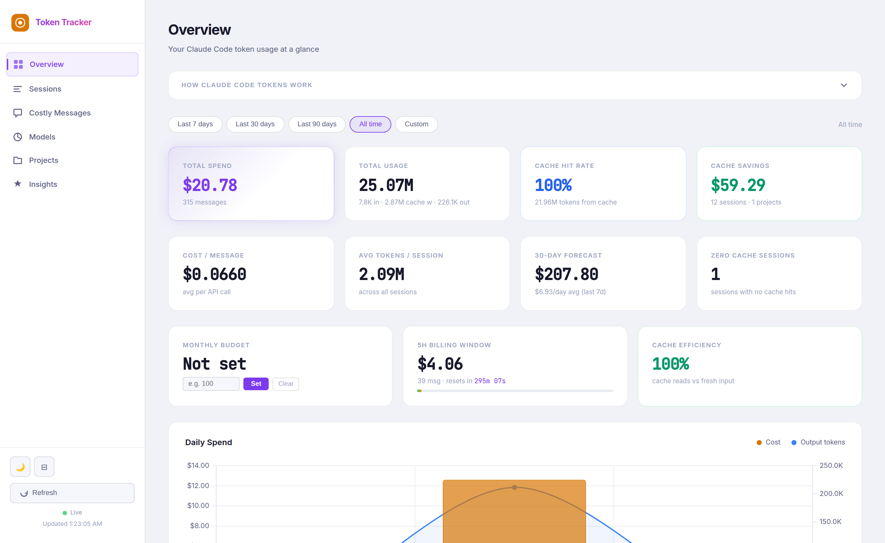

# Claude Token Tracker

A local analytics dashboard for your Claude Code token usage and spend. Reads session data directly from `~/.claude/projects/` — nothing leaves your machine.



## Quick start

```bash
npx claude-token-tracker
```

Opens `http://localhost:3737` in your browser. That's it.

## Run from source

```bash
git clone https://github.com/adptel/claude_token_tracker
cd claude_token_tracker
npm install
npm start
```

## Options

```
npx claude-token-tracker [options]

  -p, --port <n>    Port to listen on  (default: 3737)
  --no-open         Don't auto-open the browser
  --dir <path>      Custom data directory  (default: ~/.claude/projects)
  -v, --version     Show version
  -h, --help        Show help
```

## What's tracked

| Section | What you see |
|---------|-------------|
| **Overview** | Total spend · token breakdown · cache savings · 30-day forecast · cost/message · 5-hour billing window |
| **Sessions** | Every conversation ranked by cost with first prompt, model, duration, tool calls, and token detail |
| **Costly Messages** | Top 20 most expensive individual API calls with context-bloat and token-density badges |
| **Models** | Spend split by Opus / Sonnet / Haiku with a doughnut chart and per-model stats table |
| **Projects** | Cost and usage rolled up by project directory |
| **Insights** | Auto-generated tips based on your actual patterns — cache efficiency, context bloat, anomaly days, Opus vs Sonnet trade-offs |

## Real-time updates

The dashboard watches `~/.claude/projects/` for file changes. When Claude Code writes new session data (as you use it), the dashboard refreshes automatically — no manual refresh needed. A **Live** indicator in the sidebar shows the connection state.

## How it works

Claude Code writes every conversation as JSONL files under `~/.claude/projects/`. Each assistant message contains a `usage` field with `input_tokens`, `output_tokens`, `cache_creation_input_tokens`, and `cache_read_input_tokens`. This tool parses those files, applies current Anthropic pricing, and serves an analytics dashboard locally.

Two-pass deduplication handles streaming: multiple entries for the same UUID are collapsed by keeping the one with the highest `output_tokens` (the final, complete entry).

## Pricing used (per 1M tokens)

| Model | Input | Output | Cache Write | Cache Read |
|-------|------:|-------:|------------:|-----------:|
| Opus 4.x | $5.00 | $25.00 | $6.25 | $0.50 |
| Sonnet 4.x | $3.00 | $15.00 | $3.75 | $0.30 |
| Haiku 4.5 | $1.00 | $5.00 | $1.25 | $0.10 |
| Haiku 3.5 | $0.80 | $4.00 | $1.00 | $0.08 |
| Claude 3 Opus | $15.00 | $75.00 | $18.75 | $1.50 |

Matched by longest prefix against the `model` field in each JSONL entry. Falls back to Sonnet rates for unknown models.

## Privacy

- Server binds to `127.0.0.1` only — not accessible from other machines
- No telemetry, no analytics, no external API calls
- All computation happens locally; data never leaves your machine
- Chart.js is bundled locally (no CDN required)

## Requirements

Node.js 18 or later.

## License

MIT
